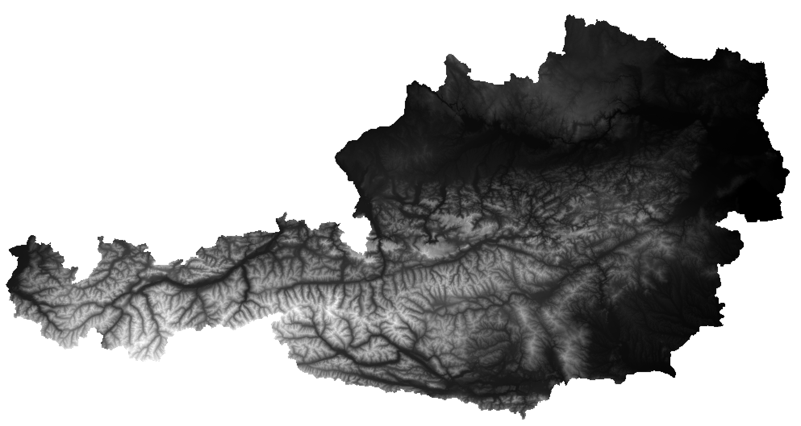
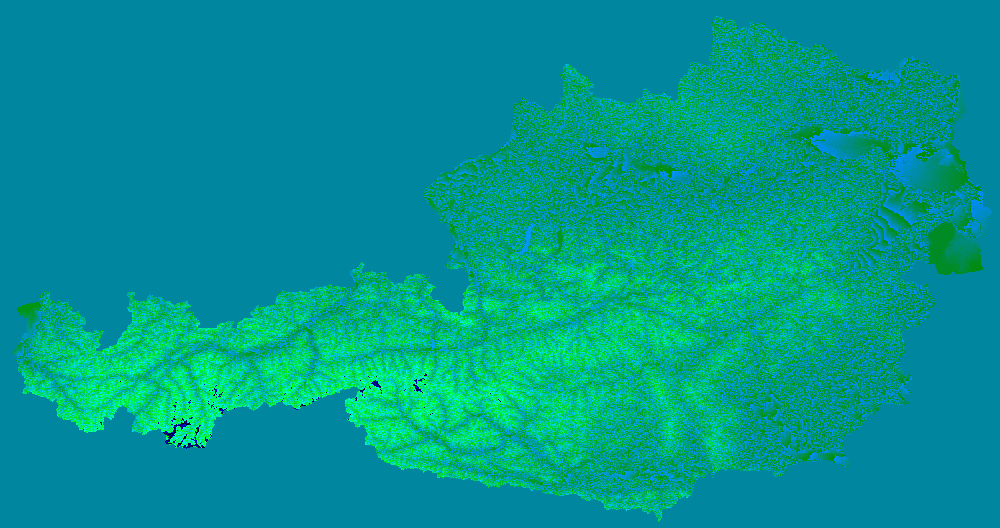
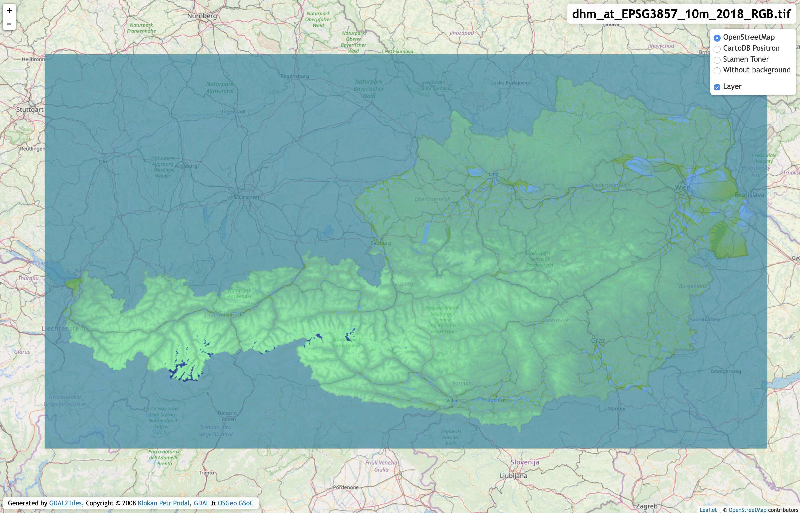
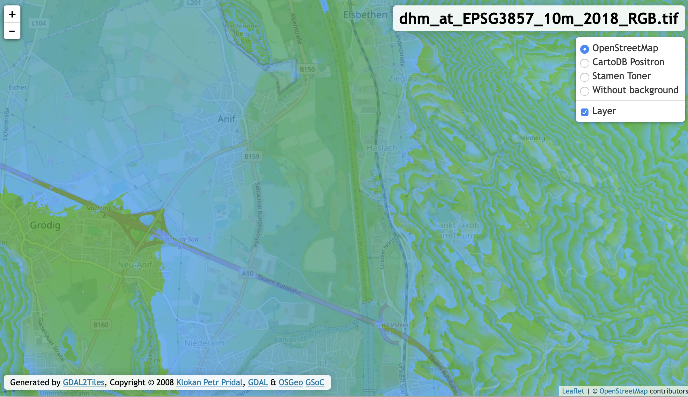

# terrain-rgb
A detailed tutorial about how to convert geo-tiff files containing Digital Elevation Model (DEM) data into a pyramid of png files. The tiles go into an MBTiles container in order to host them _offline_ with MBTileserver.

## Motivation

Austria's gonvernment is fully commited to the idea of open data. A huge amount of data is published on [Austria's open data site](https://data.gv.at). This includes spatial data like (vector) basemaps, contour lines, hillshading tiles and a lot more. Also Digital Elevation Model (DEM) data is available. The data is published as a (huge!) GeoTIFF file. Although one may convert the file into a _Cloud Optimized GeoTIFF_ (COG), the goal of this tutorial is how to convert the GeoTIFF into a pyramid of PNG files that are contained in an MBTiles container.

Based on the model of the [Mapbox Terrain-RGB](https://docs.mapbox.com/help/troubleshooting/access-elevation-data/) tileset we will document all steps required in order to create a similar set of tiles. This also means that we want our tiles to

1) use the WebMercator projection [EPSG:3857](https://epsg.io/3857)
2) be available in the zoom levels from 8 up to 15

## Tools

The open source world is full of useful tools that provide a bunch of functionality. Thanks to Docker there is no need to install them locally. Of course you can install all of the tool on your machine be we will use docker here. The ```tools``` folder of this repository contains a ```Dockerfile``` that can be used to create an image. Well will tag the image with ```rio``` since we make heavy use of Mapbox's [RasterIO](https://rasterio.readthedocs.io/en/latest/).

```shell
  cd tools
  docker create . -t rio
```
Based on the ```osgeo/gdal``` docker image we install ```rasterio``` and a few plugins from the [RasterIO Plugin Registry](https://github.com/mapbox/rasterio/wiki/Rio-plugin-registry).

## Data

Since we mentioned Austria's Open Data initiative we will use the [DEM of Austria with a resolution of 10x10m](https://www.data.gv.at/katalog/dataset/b5de6975-417b-4320-afdb-eb2a9e2a1dbf). All steps below assume that you have downloaded and extracted the GeoTIFF file. As of Feb. 2020, the name of the file containing the data is ```dhm_at_lamb_10m_2018.tif```.

### Inspecting the data

Let's see what we have got so far by starting the container and run rasterio in order to collect some information. We'll start the docker container and mount our folder ```/Users/thomas/Development/geodata/ogd-10m-at``` with the  GeoTIFF inside to the folder ```/opt/dem``` within the container's filesystem. ```rio``` is the name of the image (see section #Tools) and we want Docker to execute the shell ```bash``` inside the container.

```shell
  docker run --rm -it -v /Users/thomas/Development/geodata/ogd-10m-at:/opt/dem rio bash
```

__All commands are now executed inside the container__. We change into folder ```/opt/dem``` and execute _rasterio_ to get some basic information:

```shell
  rio info --indent 2 dhm_at_lamb_10m_2018.tif
```

The result gives us detailed insights to the GeoTIFF:

```json
  {
  "blockxsize": 256,
  "blockysize": 256,
  "bounds": [
    108875.0,
    268625.0,
    689485.0,
    586555.0
  ],
  "colorinterp": [
    "gray"
  ],
  "compress": "deflate",
  "count": 1,
  "crs": "PROJCS[\"MGI_Austria_Lambert\",GEOGCS[\"MGI\",DATUM[\"Militar_Geographische_Institute\",SPHEROID[\"Bessel 1841\",6377397.155,299.1528128000033,AUTHORITY[\"EPSG\",\"7004\"]],AUTHORITY[\"EPSG\",\"6312\"]],PRIMEM[\"Greenwich\",0],UNIT[\"degree\",0.0174532925199433],AUTHORITY[\"EPSG\",\"4312\"]],PROJECTION[\"Lambert_Conformal_Conic_2SP\"],PARAMETER[\"standard_parallel_1\",46],PARAMETER[\"standard_parallel_2\",49],PARAMETER[\"latitude_of_origin\",47.5],PARAMETER[\"central_meridian\",13.33333333300013],PARAMETER[\"false_easting\",400000],PARAMETER[\"false_northing\",400000],UNIT[\"metre\",1,AUTHORITY[\"EPSG\",\"9001\"]]]",
  "descriptions": [
    null
  ],
  "driver": "GTiff",
  "dtype": "float32",
  "height": 31793,
  "indexes": [
    1
  ],
  "interleave": "band",
  "lnglat": [
    13.32163861566811,
    47.74771359892457
  ],
  "mask_flags": [
    [
      "nodata"
    ]
  ],
  "nodata": -3.4028234663852886e+38,
  "res": [
    10.0,
    10.0
  ],
  "shape": [
    31793,
    58061
  ],
  "tiled": true,
  "transform": [
    10.0,
    0.0,
    108875.0,
    0.0,
    -10.0,
    586555.0,
    0.0,
    0.0,
    1.0
  ],
  "units": [
    "metre"
  ],
  "width": 58061
}
```

There are some very important informations here:

1) The projection is _MGI\_Austria\_Lambert_ with a _Bessel_ spheroid. This is typical for western european regions since the Lambert projection gives us the least distortions here.
2) The GeoTiff is already tiled with a block size of 256 pixel.
3) The elevation is encoded by makeing use of a ```Float32``` data type.
4) The value used to encode the semantic of _no data available_ is ```-3.4028234663852886e+38```

## Reprojection and resetting the value for _No Data_

Since we want our tiles to use the WebMercator projection EPSG:3857 we have to re-project the GeoTIFF first. To do so we can employ the ```gdalwarp``` command. In order to avoid a second processing step we also reset the value for _No Data_. The original file has a value of ```-3.4028234663852886e+38``` for this, we will set it to ```None```. This is required because we want to map the elevation values from a 32 bit signed float number to 3 unsingned bytes. And ```-3.4028234663852886e+38``` is out of scope for unsigned values.

```shell
  gdalwarp 
    -t_srs EPSG:3857 
    -dstnodata None 
    -co TILED=YES 
    -co COMPRESS=DEFLATE 
    -co BIGTIFF=IF_NEEDED 
    dhm_at_lamb_10m_2018.tif 
    dhm_at_EPSG3857_10m_2018.tif
```

This is going to take a few minutes and after it's done we can call ```rio info``` again:

```json
{
  "blockxsize": 256,
  "blockysize": 256,
  "bounds": [
    1040113.8086787398,
    5821081.891449142,
    1925726.8625255583,
    6305034.650461274
  ],
  "colorinterp": [
    "gray"
  ],
  "compress": "deflate",
  "count": 1,
  "crs": "EPSG:3857",
  "descriptions": [
    null
  ],
  "driver": "GTiff",
  "dtype": "float32",
  "height": 32586,
  "indexes": [
    1
  ],
  "interleave": "band",
  "lnglat": [
    13.321300026030602,
    47.73607122149297
  ],
  "mask_flags": [
    [
      "all_valid"
    ]
  ],
  "nodata": null,
  "res": [
    14.851554625057746,
    14.851554625057746
  ],
  "shape": [
    32586,
    59631
  ],
  "tiled": true,
  "transform": [
    14.851554625057746,
    0.0,
    1040113.8086787398,
    0.0,
    -14.851554625057746,
    6305034.650461274,
    0.0,
    0.0,
    1.0
  ],
  "units": [
    "metre"
  ],
  "width": 59631
}
```

OK, the _Coordinate Reference System_ (CRS) has changed to _EPSG:3857_. Due to the reprojection, the resolution increased from 10x10m to 14.85x14.85m.

By using [QGIS](https://qgis.org) we can visualize our greyscale data. The areas around Austria are _No Data _ areas.



## RGB-ify
Now let's transform the greyscale data into the RGB data. The formula used to calculate the elevation is

```
  height = -10000 + ((R * 256 * 256 + G * 256 + B) * 0.1)
```

So the ```base value``` is ```-10000``` and the ```interval``` (precision of the output) is ```0.1```.

```shell
  rio rgbify 
    -b -10000 
    -i 0.1
    dhm_at_EPSG3857_10m_2018_None.tif
    dhm_at_EPSG3857_10m_2018_RGB.tif
```

The image below shows the elevation data encoded in RGB values. The _No Data_ area is now at elevation zero.



The artefacts in the alps need to be further examined, most likely they are already in the original data.

## Verifying the elevation data

In order to verify that all our steps did not change the elevation data too much, we're going to check some well-known heights. Vienna's Open Data Initiative publishes a set of [proven elevation data](https://www.data.gv.at/katalog/dataset/stadt-wien_hhenfestpunktewien). 

```shell
  gdallocationinfo -wgs84 dhm_at_EPSG3857_10m_2018_RGB.tif 16.299522929921253 48.2383409011934
```

The table below shows an excerpt of randomly choosen points in Vienna:

| Name  | Lon Lat  | proven | lambert | EPSG:3857  | EPSG:3857 RGB |
|------------------|----------|--------|---------|------------|---------------|
| 1180 Utopiaweg 1 | 16.299522929921253 48.2383409011934 | 333.406 | 333.0957 | 333.0957  | 333.0 |
| 1190 Höhenstraße | 16.289583084029545 48.2610837936095 | 403.356 | 403.1385 | 403.662 | 403.6
| 1010 Stephansplatz  | 16.37255104738311 48.208694143314325 | 171.766 | 171.418  |  171.418 | 171.4  |
| 1070 Lindengasse 3 | 16.354641842524874 48.201276304040626 | 198.515 | 198.0624 | 198.2035 | 198.2 |
| 1220 Industriestraße 81 | 16.44120643847108 48.225003606677504 | 158.911 | 158.625 | 158.625 | 158.6 |

To our knowledge the other federal provinces of Austria do not provide any open site datum.

## Tile pyramid

The last step of our journey is to cut the huge GeoTiff into a pyramid of tiles with a size of 256x256 pixel. Your favorite search engine will come up with a lot of ways to do so:

* gdal_translate with gdaladdo
* rasterio mbtiles
* gdal2mbtiles
* gdal2tiles

For us only the last one was successful. Create a new folder (e.g. ```tiles```) where to put the tiles to. 

> Attention: None of processing steps mentioned here is done quickly, but the following is __very time consuming__. You should test the results first by reducing the zoom level(s) to either a single one (e.g. ```--zoom=8``` or at least to leves with lower details.

On our 2019 Intel Core i9 with 8 cores the calculation of the tiles took more than two hours!

```shell
  gdal2tiles.py --zoom=5-15 --processes=8 dhm_at_EPSG3857_10m_2018_RGB.tif ./tiles
```

> Optimization: The size of the resulting tile pyramid is 6.1 GByte. We are pretty sure that this process can be optimized by telling ```gdal2tiles``` to skip all tiles for the _No Data_ areas. This will increase the processing speed and decrease the number of tiles required.

Besides the tiles ```gdal2tiles``` also creates a simple web application that you can use to view the result (we like the Leaflet version the most):

The two screenshots below show the rendered tiles as an overlay to Open Street Map at zoom level 8 (Austria) and level 14 (Salzburg/Grödig).





## MBTiles container

Mapbox is one of the leading providers of maps and location services. They made most of their specifications and software Open Source. Besides the [MBTile Specification](https://github.com/mapbox/mbtiles-spec) they also provide [mbutil](https://github.com/mapbox/mbutil) which is a tools for putting tilesets into an MBTiles container.

```mb-util``` imports an ```metadata.json``` file if it exists in the root of the ```tiles``` folder. For a pretty naming we can create one like this:

```json
  {
    "name": "Digitales Geländemodell (DGM) Österreich ",
    "description": "Digitales Geländemodell (DGM) Österreich, CC-BY-4.0: Land Kärnten - data.ktn.gv.at",
    "version": "3"
  }
```

Whooa, now for the final step! Run this command and be a little patient ;-) 

```shell
  mb-util --image_format=png --scheme=tms ./tiles/ ./dhm_at_EPSG3857_10m_2018.mbtiles
```

The optional ```--silent``` parameter would suppress the output of the tiles processed. 

Creating the MBTile container takes a lot of time and the resulting mbtiles file has a similar size as the folder containing the PNG files (6 GB).

## Hosting

We have been using [tileserver-gl](https://github.com/maptiler/tileserver-gl) for our [Hosting basemap.at vector tiles offline](https://github.com/syncpoint/basemap.at) tutorial. For the elevation data tutorial we will be using [mbtileserver](https://github.com/consbio/mbtileserver) which is written in go. _mbtileserver_ is a single executable that automatically provides all MBTiles containers that are located in a child-folder (```tilesets```) of the executable. Please consult the github site of mbtileserver for installation instructions.

```shell
  ❯ ~/go/bin/mbtileserver --verbose
  INFO[0000] Found 1 mbtiles files in ./tilesets

  --------------------------------------
  Use Ctrl-C to exit the server
  --------------------------------------
  HTTP server started on port 8000
```

Navigate your favorite browser to ```http://localhost:8000/services``` and you will receive a description of the (tile) services provided:

```JSON
  [{"imageType":"png","url":"http://localhost:8000/services/dhm_at_EPSG3857_10m_2018"}]
```

Open the url and you will receive even more details, including the ```z/x/y``` url for the tiles:

```JSON
  {
  "description": "Digitales Geländemodell (DGM) Österreich, CC-BY-4.0: Land Kärnten - data.ktn.gv.at",
  "format": "png",
  "id": "dhm_at_EPSG3857_10m_2018",
  "map": "http://localhost:8000/services/dhm_at_EPSG3857_10m_2018/map",
  "maxzoom": 15,
  "minzoom": 5,
  "name": "Digitales Geländemodell (DGM) Österreich ",
  "scheme": "xyz",
  "tilejson": "2.1.0",
  "tiles": [
    "http://localhost:8000/services/dhm_at_EPSG3857_10m_2018/tiles/{z}/{x}/{y}.png"
  ],
  "version": "3"
}
```

We have some UTF-8 encoding problems for german umlauts, but you can safely ignore these.

> Now you have ready-to-use elevation tiles that are compatible with Mapbox' _Terrain RGB_ tiles and are available offline!

# ToDo

* Reduce the number of tiles by skipping the areas without elevation data. We estimate the potential savings are approximately 35%.
* Examine the artefacts in the alps.
* Verify the elevation on randomly distributed locations over Austria.

# References

* [Digitales Geländemodell (DGM) Österreich (DEM of Austria with a resolution of 10x10m)](https://www.data.gv.at/katalog/dataset/b5de6975-417b-4320-afdb-eb2a9e2a1dbf) CC-BY-4.0: Land Kärnten - data.ktn.gv.at
* [Höhenfestpunkte Wien ('Vienna site datum')](https://www.data.gv.at/katalog/dataset/stadt-wien_hhenfestpunktewien) Datenquelle: Stadt Wien – https://data.wien.gv.at 